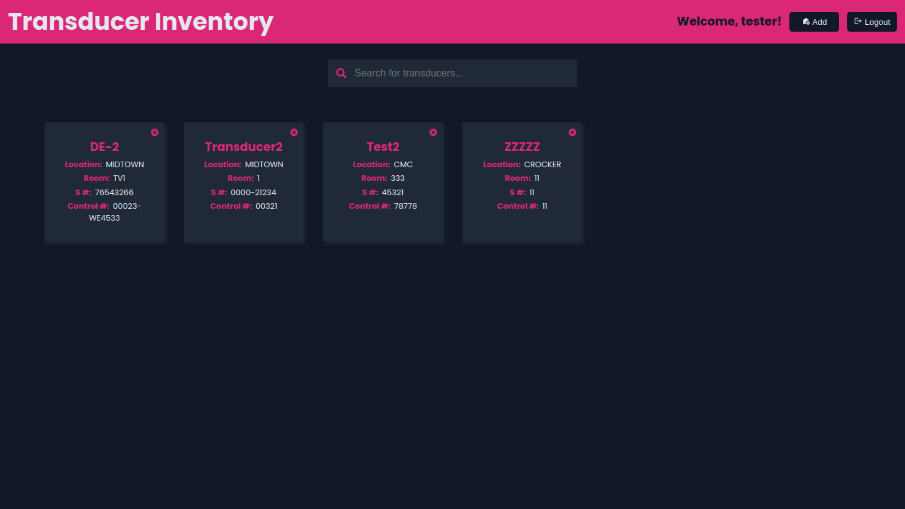
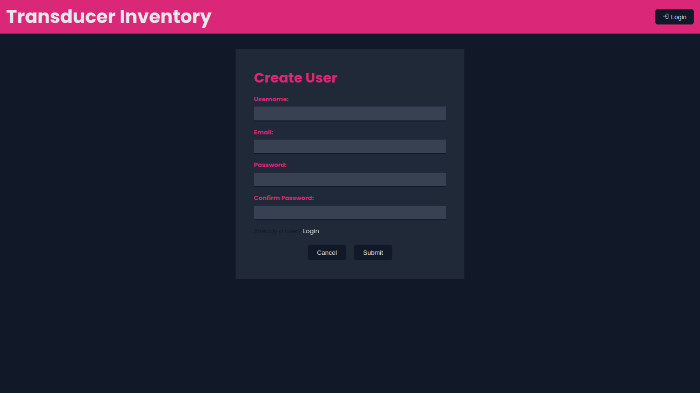
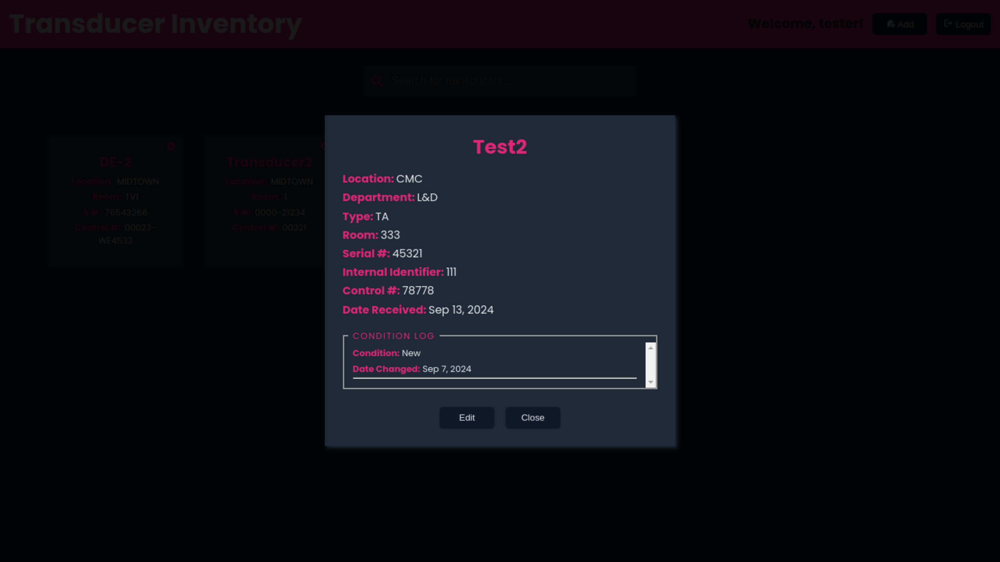

# Sonographer Transducer Inventory Application
Frontend web application used to manage transducer inventory in a healthcare setting.

Built using React.js, TypeScript, and CSS Modules. Connects to the transducer-inventory-api Express.js and MongoDB backend.

## Create .env
Create a .env file in the root of repository and add:

`VITE_API_URL=http://localhost:5000/api`

## Start dev server

`npm run dev`

## Run unit tests

`npm test`

